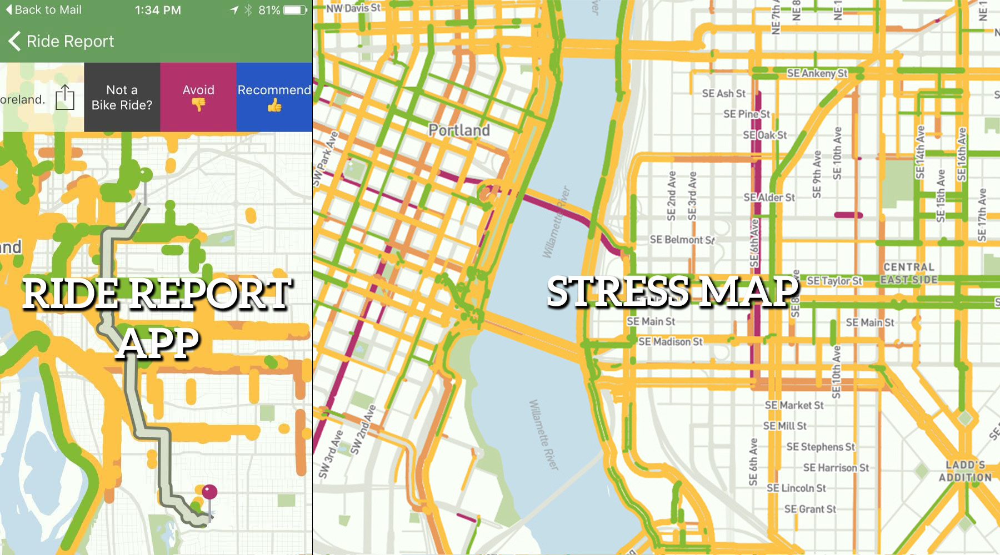
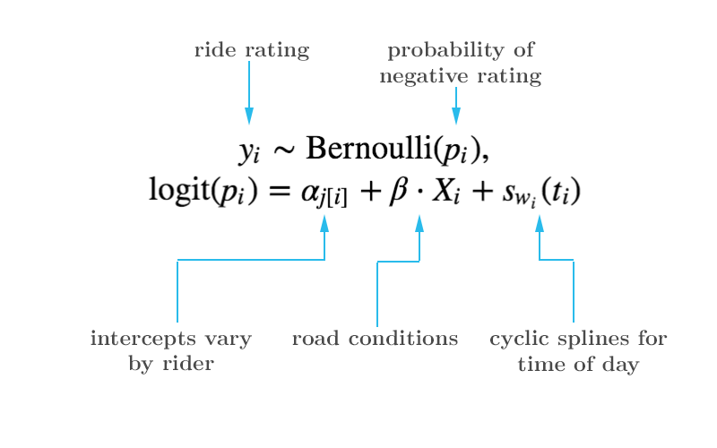

# Multilevel Models and Missing Data Models for Crowdsourced Bicycle Route Ratings
### May 2016

This is my undergraduate thesis, which I completed my senior year at Reed College.
[Andrew Bray](http://andrewpbray.github.io/) advised this thesis. This project
was done in collaborate with Knock Software, creators of the Ride Report app.

My aim in this project was to improve way the Ride Report stress map is created.
[The Ride Report app](ride.report) collects commuting bicyclists' routes and their
ratings of those routes. From this crowdsourced data set of bicycle route ratings,
they create a map of Portland, OR that shows each road segment colored according
to the average ratings of the ride that goes through it. They call it the [stress
map](ride.report/map). Though the averaging method gives results that are acceptable,
we suspected that we could do better by building a probabilistic model for the
effect of route on ride rating.

It turns out there are three majors hurdles in building this model: First, to
develop a model that accounts for covariates other than route; second, to
implement an algorithm for
mapping GPS traces of routes into sequences of road segments *with output suitable
for modelling*; and third, to develop a model that can estimate a parameter for
each road segments' contribution to the ride rating. Because I was short on time,
I had to focus on the first piece.

We identified three predictors besides route that the model should account for: time of
day, weather and road conditions, and the variation in cyclists' tendency to
give a negative rating. We propose using a logistic regression model
with weather and road conditions as normal predictors, time of day fit with a
cyclic cubic spline, and cyclist variation modelled with varying intercepts.

In the course of exploring this data, we also did several other analyses. We
explored correcting for a non-ignorable bias in which rides were giving rates,
suspecting that rides with negative experiences were more likely to be rated
than those that were uneventful. Though we implemented the methods described in
[Ibrahim's 1996 paper](https://www.jstor.org/stable/2533068), the results were not
useful because we know many of the rides missing ratings are car or transit rides
that were incorrectly classified as bike rides. As that classification improves,
we suspect this method may produce more useful insight into the model.

## File Structure

We have attempted to make this analysis reproducible, though we are not able to
share the data we worked with. It contains confidential information of riders,
such as their exact commutes between their home and workplace. 

The repository is organized as follows:

- **analysis**: contains exploratory analysis from original work on data
manipulation and cleaning.
- **data**: contains some data. For privacy and license reasons, most of the
data is not availible in the repository.
- **model_iterations**: contains the scripts that ran the actual models in this
analysis. Most of the figures in the thesis come from these R markdown files.
- **logs**: contains weekly logs reporting work done for the past week. 
- **R**: contains R functions written as part of the package to manipulate data
- **thesis**: All of the writing for the thesis document. It is written entirely
in R Markdown, created from an R markdown thesis template, which can be found at
<https://github.com/Reedies/reedtemplates>)

## Outline
**Chapter 1: Data sources** details the collection methods of the data sources used,
including the Ride Report data as well as weather data.

**Chapter 2: Methods** outlines the main modeling methods used, including 
logistic regression, multilevel models, and additive models, to keep the analysis
accessible for most readers. 

**Chapter 3: Modeling Rides and Riders** compares
six iteratively built statistical models, importantly demonstrating that the 
differences in average ride rating throughout the day can be account better
by differences in the base rate at which riders give negative ratings rather
than an universal daily pattern. 

**Chapter 4: Classifying Riders** attempts
to map out the distinction between different kinds of rider and then uses
these classifications to improve models developed in the previous chapter. 

**Chapter 5: Modeling Missing Response** reports the results of using expectation
maximization to use ride observations that are missing a rating to reduce the
potential bias in estimates in previous models and, at the same time, model
the missing data mechanism.

**Chapter 6: Unfinished Work: Modeling Routes** outlines the data transformation
challenges we faced and puts forward some suggestions for models that incorporate
route information.
