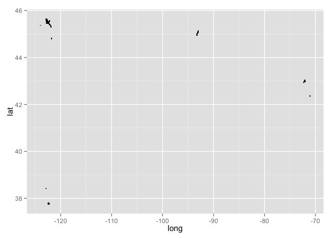
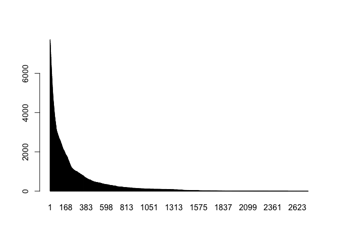
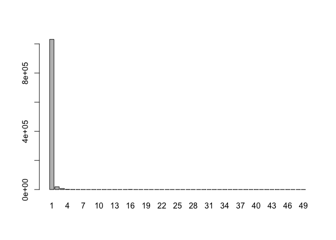
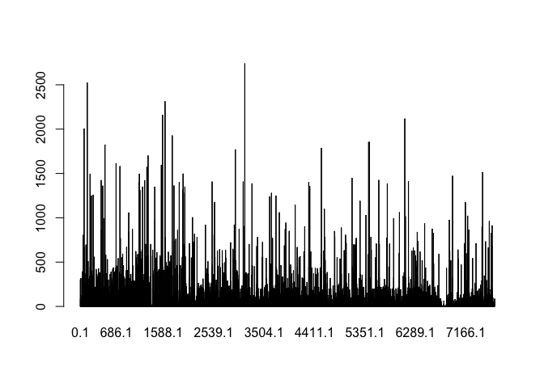
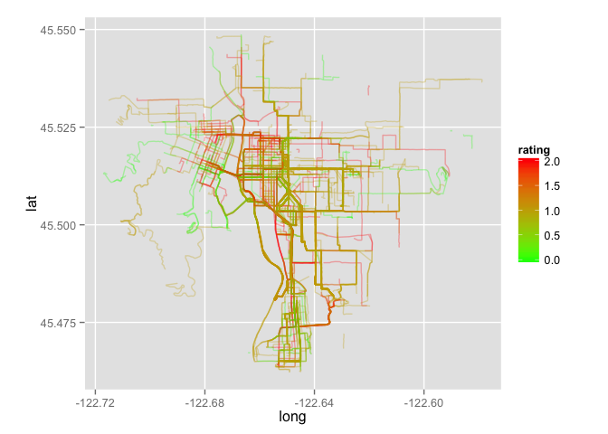

# Personal Data
Will Jones  
October 26, 2015  


Here we have data provided by William Henderson, containing data from 5 riders.


```r
bikeroutes.shapefile <- readOGR("../data/RIDE/william-trips-export.json", "OGRGeoJSON", p4s="+proj=tmerc +ellps=WGS84")
```

```
## OGR data source with driver: GeoJSON 
## Source: "../data/RIDE/william-trips-export.json", layer: "OGRGeoJSON"
## with 7712 features and 13 fields, of which 1 list fields
## Feature type: wkbLineString with 2 dimensions
```

```r
bikeroutes.df <- fortify(bikeroutes.shapefile)

# bikeroutes.df <- bikeroutes.df %>%
#   left_join(bikeroutes.shapefile@data, by="pk")

head(bikeroutes.df)
```

```
##        long      lat order piece group id
## 1 -122.6532 45.50247     1     1   0.1  0
## 2 -122.6532 45.50247     2     1   0.1  0
## 3 -122.6532 45.50247     3     1   0.1  0
## 4 -122.6532 45.50247     4     1   0.1  0
## 5 -122.6531 45.50240     5     1   0.1  0
## 6 -122.6530 45.50235     6     1   0.1  0
```

```r
ggplot(bikeroutes.df, aes(x=long, y=lat, group=group)) + geom_path()
```

 

Okay. The data produced by fortifying the bikeroutes dataframe is rather strange.


```r
barplot(table(bikeroutes.df$order))
```

 

```r
barplot(table(bikeroutes.df$piece))
```

 

```r
barplot(table(bikeroutes.df$group))
```

 

Group has 8192 levels, but there were originally 7712 lines. How do we know which
ride is which? The group has a strange system, where the numbers are zero-indexed
and the decimal place corresponds to the piece. So to get an ID we can just 


```r
bikeroutes.df$group %>% as.character() %>% as.numeric() %>% ceiling() %>% summary()
```

```
##    Min. 1st Qu.  Median    Mean 3rd Qu.    Max. 
##       1    1435    3138    3386    5220    7712
```

```r
bikeroutes.df$id <-
  bikeroutes.df$group %>% as.character() %>% as.numeric() %>% ceiling()
```

Really we need two dataframes: one for all the points that make up the paths
and one just with an observation for each route.


```r
rides <- bikeroutes.shapefile@data %>%
  select(rating,
         rating_text,
         owner__pk,
         original_trip_length,
         created,
         pk,
         rr_transformation) %>%
  tbl_df()
```

Okay, but now we have another weird issue.


```r
head(rides)
```

```
## Source: local data frame [6 x 7]
## 
##   rating rating_text                            owner__pk
##    (int)      (fctr)                               (fctr)
## 1      1        good 03a89822-6c9f-4d49-a4fc-68849e8c25b5
## 2      1        good 03a89822-6c9f-4d49-a4fc-68849e8c25b5
## 3      1        good 03a89822-6c9f-4d49-a4fc-68849e8c25b5
## 4      1        good 03a89822-6c9f-4d49-a4fc-68849e8c25b5
## 5      1        good 2b16837b-7bd0-46f8-a208-829735957413
## 6      1        good 2b16837b-7bd0-46f8-a208-829735957413
## Variables not shown: original_trip_length (dbl), created (fctr), pk
##   (fctr), rr_transformation (fctr)
```

```r
head(bikeroutes.df %>% filter(order == 1))
```

```
##        long      lat order piece group id
## 1 -122.6532 45.50247     1     1   0.1  1
## 2 -122.6532 45.50248     1     1   1.1  2
## 3 -122.6532 45.50247     1     1   2.1  3
## 4 -122.6532 45.50248     1     1   3.1  4
## 5 -122.6498 45.51493     1     1   4.1  5
## 6 -122.6496 45.51493     1     1   5.1  6
```

It seems like we have less data than we thought. It seems that there are four
observations of every ride. One variable `rr_transformation` seems to explain
on dimension of this duplication. This does explain why there are only 1928
primary keys and 7712 observations:
$$1928 \times 4 = 7712.$$


```r
rides <- rides %>%
  mutate(id = 1 + as.numeric(rownames(rides))) %>%
  distinct(pk)

rides.final <- bikeroutes.df %>%
  inner_join(rides, by="id")
```


This seems to include locations outside of Portland, OR. So let's filter this data.


```r
not.in.portland <- rides.final %>%
  filter(lat < 45.462 | lat > 45.549 | long > -122.577 | long < -122.722) %>%
  distinct(pk) %>%
  .$pk

rides.final %>%
  filter(!pk %in% not.in.portland) %>%
  ggplot(aes(x = long, y = lat, group = group)) +
  geom_path(alpha=0.3, aes(col=rating), lineend = "butt") +
  coord_map(projection = "mercator") + 
  scale_color_gradient2(low = "yellow", mid = "green", high = "red")
```

```
## Warning: Non Lab interpolation is deprecated
```

 

That's quite a bit of coverage for only five people!
