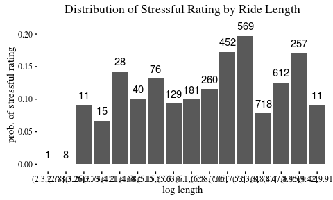
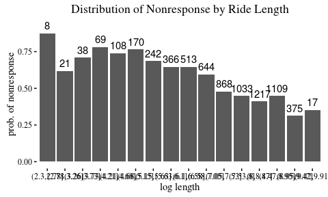
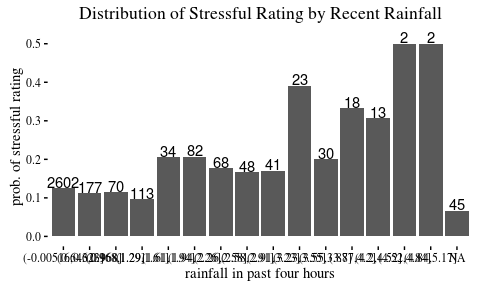
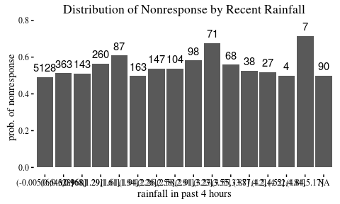
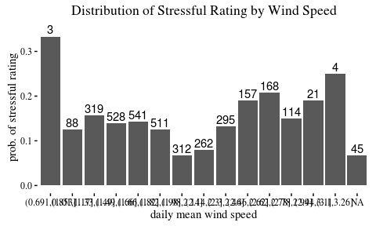
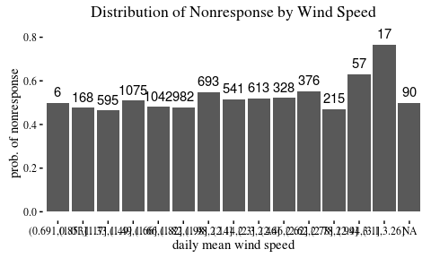
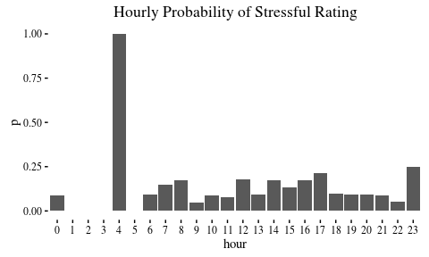
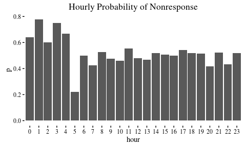
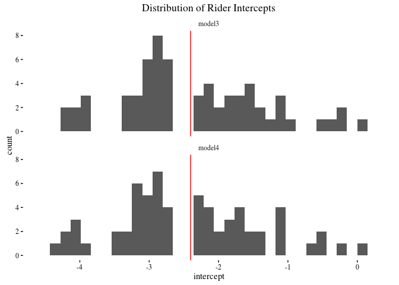
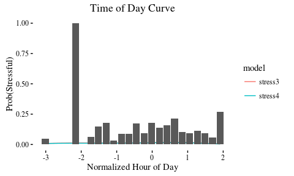

# First Model
Will Jones  
December 8, 2015  

## Introduction

As our first steps in modeling ride rating, we will start to model without route
data. Instead we will focus on other question in the modeling as a start for our
model:

- How much variation is there between riders in how they tend to rate rides?
- What relationship does weather, like rain or wind speed, have with ride
rating?
- How does ride rating fluctuate with time of day (which we use as a proxy for
traffic)?

We actually expect a fair amount of the variance in ride rating to be explained
by these variables, based on tests of a smaller sample.

## Some Numbers about the Data

There are 6798 rides in the data set, with 3430
(50.4560165%) rides with no rating.

## What variables will we include?

### Length

### Weather

We also want to consider patterns with weather. We have data on daily weather,
including wind speed, temperature highs and lows, and rain data. But we also
have hourly rain data from a local fire station.

### Traffic / Daily Trends

We would like to incorporate traffic, but to simplify our model, we may simple
use time of day as a proxy.

## The Models

### Classical Model

First, we consider how a classical logistic regression model compares to
a model with a random intercept for riders. So we will model:

\[
Y = \text{logit}^{-1} \left(
\alpha + \beta_1 \cdot \text{log.length} + \beta_2 \cdot \text{log.wind speed} +
\beta_3 \cdot \text{log.rainfall.4h}
\right).
\]

### Just Rider Random Effects

Now we want to explore how we can capture variance with and between riders. So
we will use the basic model

\[
Y \sim \text{Bernoulli} (\text{logit}^{-1}(\alpha_{j[i]})),
\quad
\alpha_{j[i]} \sim \text{Normal}(\mu_\alpha, \sigma^2_\alpha).
\]

### Add Time of Day Effects

Now we want to add effects based on time of day. We will try using polynomial
regression to do this first, by adding to our regression the terms,

\[
\beta_1 \cdot \text{hour} + 
\beta_2 \cdot \text{hour}^2 + 
\beta_3 \cdot \text{hour}^3 + 
\beta_4 \cdot \text{hour}^4.
\]

### All Effects

Our last model will take the rider intercepts and day effects and add the terms
we had in our first regression with variables. 

## Table of coefficients

For now, we will compute these models using maximum likelihood. Later, we might
do Bayesian inference with STAN.

<table style="text-align:center"><caption><strong>results</strong></caption>
<tr><td colspan="5" style="border-bottom: 1px solid black"></td></tr><tr><td style="text-align:left"></td><td colspan="4"><em>Dependent variable:</em></td></tr>
<tr><td></td><td colspan="4" style="border-bottom: 1px solid black"></td></tr>
<tr><td style="text-align:left"></td><td colspan="4">stressful</td></tr>
<tr><td style="text-align:left"></td><td><em>logistic</em></td><td colspan="3"><em>generalized linear</em></td></tr>
<tr><td style="text-align:left"></td><td><em></em></td><td colspan="3"><em>mixed-effects</em></td></tr>
<tr><td style="text-align:left"></td><td>(1)</td><td>(2)</td><td>(3)</td><td>(4)</td></tr>
<tr><td colspan="5" style="border-bottom: 1px solid black"></td></tr><tr><td style="text-align:left">log.length</td><td>0.096</td><td></td><td></td><td>0.167*</td></tr>
<tr><td style="text-align:left"></td><td>(0.072)</td><td></td><td></td><td>(0.090)</td></tr>
<tr><td style="text-align:left"></td><td></td><td></td><td></td><td></td></tr>
<tr><td style="text-align:left">rainfall.4h</td><td>0.018***</td><td></td><td></td><td>0.019***</td></tr>
<tr><td style="text-align:left"></td><td>(0.005)</td><td></td><td></td><td>(0.006)</td></tr>
<tr><td style="text-align:left"></td><td></td><td></td><td></td><td></td></tr>
<tr><td style="text-align:left">mean.wind.speed</td><td>-0.0002</td><td></td><td></td><td>0.00001</td></tr>
<tr><td style="text-align:left"></td><td>(0.018)</td><td></td><td></td><td>(0.019)</td></tr>
<tr><td style="text-align:left"></td><td></td><td></td><td></td><td></td></tr>
<tr><td style="text-align:left">hour</td><td></td><td></td><td>0.303**</td><td>0.274*</td></tr>
<tr><td style="text-align:left"></td><td></td><td></td><td>(0.154)</td><td>(0.154)</td></tr>
<tr><td style="text-align:left"></td><td></td><td></td><td></td><td></td></tr>
<tr><td style="text-align:left">I(hour2)</td><td></td><td></td><td>-0.046</td><td>-0.086</td></tr>
<tr><td style="text-align:left"></td><td></td><td></td><td>(0.161)</td><td>(0.163)</td></tr>
<tr><td style="text-align:left"></td><td></td><td></td><td></td><td></td></tr>
<tr><td style="text-align:left">I(hour3)</td><td></td><td></td><td>-0.153**</td><td>-0.144*</td></tr>
<tr><td style="text-align:left"></td><td></td><td></td><td>(0.076)</td><td>(0.076)</td></tr>
<tr><td style="text-align:left"></td><td></td><td></td><td></td><td></td></tr>
<tr><td style="text-align:left">I(hour4)</td><td></td><td></td><td>-0.043</td><td>-0.035</td></tr>
<tr><td style="text-align:left"></td><td></td><td></td><td>(0.037)</td><td>(0.037)</td></tr>
<tr><td style="text-align:left"></td><td></td><td></td><td></td><td></td></tr>
<tr><td style="text-align:left">Constant</td><td>-1.910***</td><td>-2.569***</td><td>-2.503***</td><td>-2.577***</td></tr>
<tr><td style="text-align:left"></td><td>(0.133)</td><td>(0.250)</td><td>(0.271)</td><td>(0.299)</td></tr>
<tr><td style="text-align:left"></td><td></td><td></td><td></td><td></td></tr>
<tr><td colspan="5" style="border-bottom: 1px solid black"></td></tr><tr><td style="text-align:left">Observations</td><td>2,262</td><td>2,262</td><td>2,262</td><td>2,262</td></tr>
<tr><td style="text-align:left">Log Likelihood</td><td>-902.967</td><td>-768.043</td><td>-762.117</td><td>-755.048</td></tr>
<tr><td style="text-align:left">Akaike Inf. Crit.</td><td>1,813.934</td><td>1,540.086</td><td>1,536.233</td><td>1,528.096</td></tr>
<tr><td style="text-align:left">Bayesian Inf. Crit.</td><td></td><td>1,551.534</td><td>1,570.577</td><td>1,579.612</td></tr>
<tr><td colspan="5" style="border-bottom: 1px solid black"></td></tr><tr><td style="text-align:left"><em>Note:</em></td><td colspan="4" style="text-align:right">*p<0.1; **p<0.05; ***p<0.01</td></tr>
</table>

### Rider Intercepts

### Hourly Trends

## Model Accuracy and Fit

### Separation Plots

