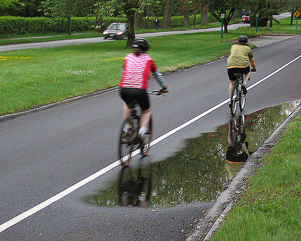
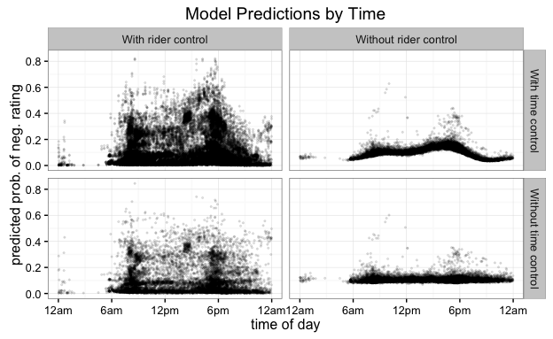

## Ride Report and the Stress Map

## Three Main Challenges

(1) **Develop model for data collection process**
(2) **Match routes to road network**
(3) **Develop model for routes**

> - Step (3) will require careful thinking: large num of parameters.
> - Step (2) is a software dev challenge. Need more general implementation.
> - Step (1) was the focus of our research.

## Data Collection

- Rides from Ride Report App
- Weather from local weather stations

## How a ride is recorded

> 1. Ride start is recorded (ML)
> 2. GPS Route is recorded
> 3. Ride end detected (ML)
> 4. Route type (bike, car, train, bus, etc.) classified (ML)
> 5. Rider prompted for rating (human)
> 6. Route uploaded and matched to OSM road network.

## The Tradeoff
> - Only 1 human step -> larger sample size
> - But more data does not always mean quality data:
>     * You aren't measuring what you think you are measuring
>     * ML Models make errors

## Modeling Goals

Correct for:

> - riders' differing rating criteria
> - weather: avg. temp, wind speed, rainfall, recent rainfall
> - ride length
> - time of day (traffic, visibility, etc.)
> - nonresponse

## A Logistic Regression Model

> - $y_i$ are ratings
> - $X$ are ride predictors
> - $j[i]$ is the rider of the $i$th ride
> - $t$ is the start time of day in hours

$$y_i \sim \text{Bernoulli}(p_i),$$
$$\text{logit}(p_i) = \alpha_0 + \alpha_{j[i]} + X \beta + s(t),$$
$$\alpha_{j[i]} \sim \text{Normal}(0, \sigma_\alpha^2).$$

$s(t)$ is cyclic cubic spline, w/ knots at every 3 hours.

## Linear predictors

- Ride length
- Rainfall & Rainfall 4 hour cumulative
- Temperature, wind speed, gust speed

<!-- Create a plot of predictor coefficients -->

- Recent rainfall

## Bike Lanes Flood!

Photo by Richard Drdul. (https://www.flickr.com/photos/drdul/177247505)

## Random Intercepts for Riders

Going to assume that riders are consistent with own ratings, but have different
baselines from each other. Thus, we will have an intercept for each riders. i.e.

$$\text{logit} (p_i) = \alpha_0 + \alpha_{j[i]} + X \beta + s(t)$$

$$\alpha_{j[i]} \sim N(0, \sigma_\alpha^2).$$

## Cyclic Splines for Time of Day

## Time of Day and Riders

## Missing Data and the EM Algorithm

Used EM Algorithm.
Didn't work well. Why?

> Because of the misclassified rides

## Conclusion

Future hypotheses to test when full model exists:

- Variance of rider intercepts will be reduced
- Time of day effects reduced
