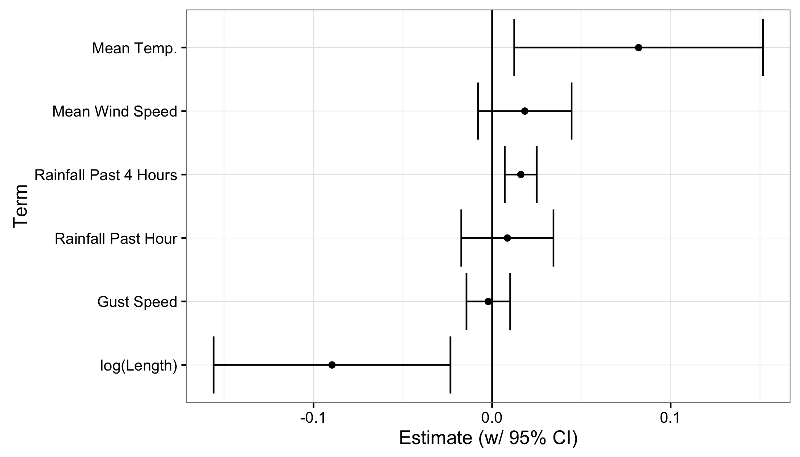
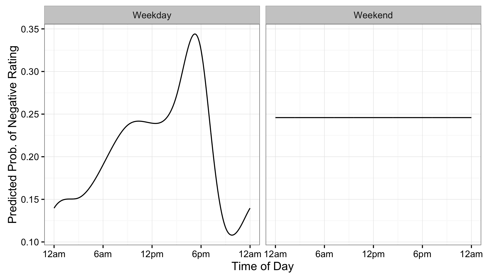

## About This Research

- This work is from my undergraduate thesis at Reed College
- Was advised by Andrew Bray

## Ride Report and the Stress Map

## Three Main Challenges

(1) **Develop model for data collection process**
(2) Adapt algorithm for map matching
(3) Develop model for routes

<!--
## The Data

1. Rides from Knock Software
2. Daily weather summaries from Weather Underground
3. Hourly percipitation data from local fire station

## How a ride is recorded

> 1. Ride start is recorded (ML)
> 2. GPS Route is recorded
> 3. Ride end detected (ML)
> 4. Route type (bike, car, train, bus, etc.) classified (ML)
> 5. Rider prompted for rating (human)
> 6. Route uploaded and matched to OSM road network.

## The Tradeoff
> - Only 1 step needs a human, so sample size is larger.
> - But this comes at the cost of quality in two ways:
>     1. Ratings measure more than just effect of route
>     2. Errors in ML models have implications for our model

-->

## Modeling Goals

### Correct for:

> - riders' differing rating criteria
> - ride length
> - time of day (for traffic and maybe other things)
> - weather:
>     * Daily: avg. temp, mean wind speed, max gust speed
>     * Hourly: rainfall during ride, rainfall past 4 hours

### How to model?
> - weather + ride length with linear predictors
> - riders with random intercepts
> - time of day effect with cyclic splines (by weekday/weekend)

## A Logistic Regression Model

> - $y_i$ are ratings
> - $X$ are ride predictors
> - $j[i]$ is the rider of the $i$th ride
> - $t_i$ is the start time of ride $i$ in hours
> - $w_i$ is an indicator for weekend

 $$y_i \sim \text{Bernoulli}(p_i),$$
 $$\text{logit}(p_i) = \alpha_{j[i]} + \beta \cdot  X_i + s_{w_i}(t_i)$$
 

 
> - $s_{w_i}(t)$ are two cyclic cubic splines, for weekdays and weekends, w/ knots at every 3 hours.
> - Model fit with gamm4 package in R

## Linear predictors

## Bike Lanes Flood!

Photo by Richard Drdul. (https://www.flickr.com/photos/drdul/177247505)

## Random Intercepts for Riders

The random intercepts were very informative for the model:

<table>
<thead>
<tr><th>$\alpha_{j[i]}$</th><th>$\beta X_i$</th><th>$s_{w_i} (t_i)$</th><th>AIC</th></tr>
</thead>
<tbody>
<tr><td>X</td><td>X</td><td>X</td><td>9096</td></tr>
<tr><td></td><td>X</td><td>X</td><td>10755</td></tr>
<tr><td>X</td><td></td><td>X</td><td>9127</td></tr>
<tr><td>X</td><td>X</td><td></td><td>9153</td></tr>
</tbody></table>

> - Maybe: Effect of cyclists' typical route absorbed by intercept

## Cyclic Splines for Time of Day

## Time of Day and Riders

## Conclusion

> - This is a start towards a goal of building a better "Stress Map""

Future models should:

> - Make use of the rider intercepts, time of day splines, and weather data
> - Use more granular weather data
> - Be aware of the correlation between rider intercepts, time of day, and route

